# CVE-2023-27216_D-Link_DSL-3782_Router_command_injection

## 漏洞描述

### 编号

CVE-2023-27216  

### 设备信息

**D-Link DSL-3782 ：**  
DSL-3782_REVA_FIRMWARE_PATCH_v1.03 and below  

### 漏洞类型

RCE  

### 危害

可访问路由器的攻击者需凭借凭证方可执行远程代码  

## 复现流程

### 复现设备

**D-Link DSL-3782 ：**  
DSL-3782_REVA_FIRMWARE_PATCH_v1.01  

### 固件仿真

同CVE-2022-34527_D-Link_DSL-3782_Router_command_injection
<https://media.dlink.eu/support/products/dsl/dsl-3782/driver_software/dsl-3782_a1_eu_1.01_07282016.zip>

### 漏洞分析

已公开信息：  
> An issue found in D-Link DSL-3782 v.1.03 allows remote authenticated users to execute arbitrary code as root via OS command injection in multiple setting pages. Settings known to be affected by this issues are:  

- Subnet mask fields in network configuration  
- Remote log server IP field in logging configuration  
- Every field in port forwarding configuration  
- Every field in static routes configuration  

>The input provided by the user is insufficiently sanitized by the server, so bypassing the client-checks it is possible to inject arbitrary strings directly into .sh scripts. Depending on the affected field, the maximum payload length allowed will be different. Generally speaking, it is possible to inject between 15 and 50 characters. To exploit CVE-2023-27216 an attacker with remote access to the web interface of the D-Link DSL-3782 needs to inject a malicious payload into one of the affected fields. An example of working payload is: `; ping example.org #`.  

大致分为四个 source 点，以下以第一点 Subnet mask fields in network configuration 为例。  
找到 web 实现功能的页面  
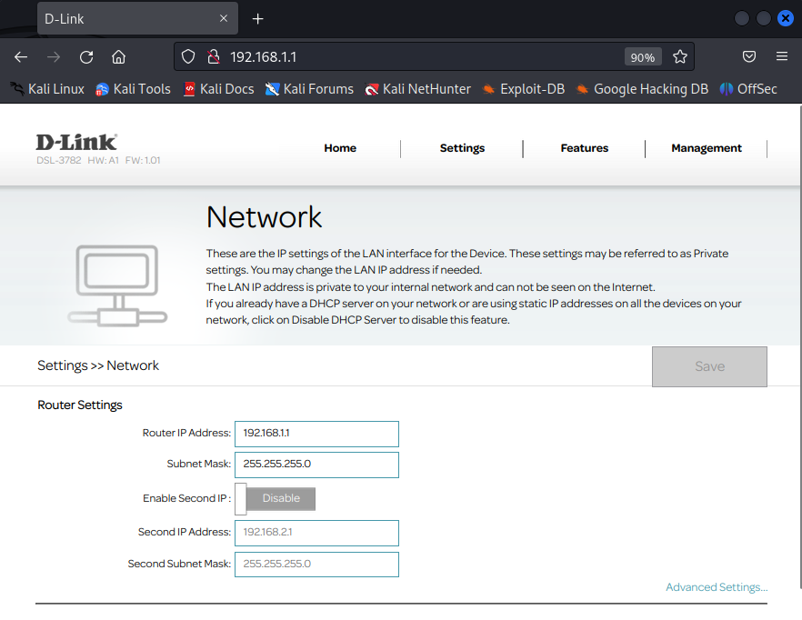  
保存后请求的 path boaroot/cgi-bin/New_GUI/Set/Network.asp  
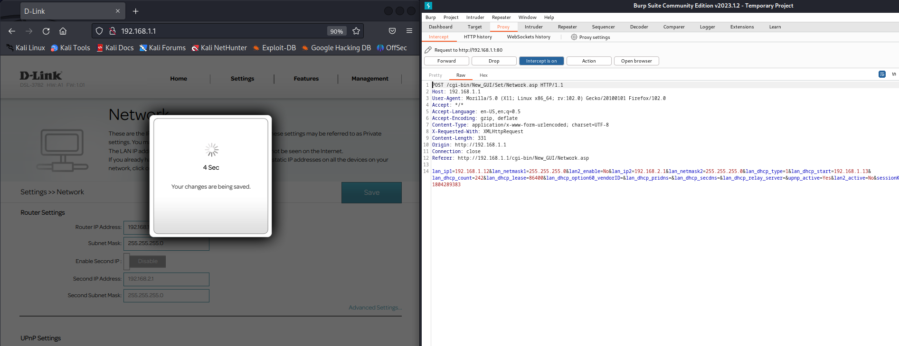  
找到文件，根据 Subnet mask fields 的参数名`lan_netmask1`定位到参数名 `netmask`  
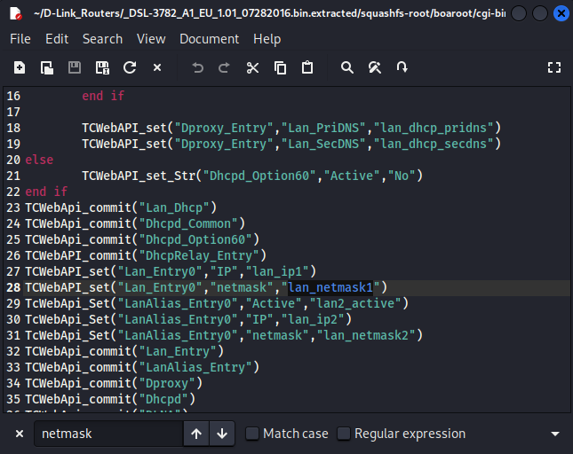  
逆向 cfg_manager 跟进到一个没函数名的代码段,  将参数拼接进了一个 .sh 脚本  
  
  
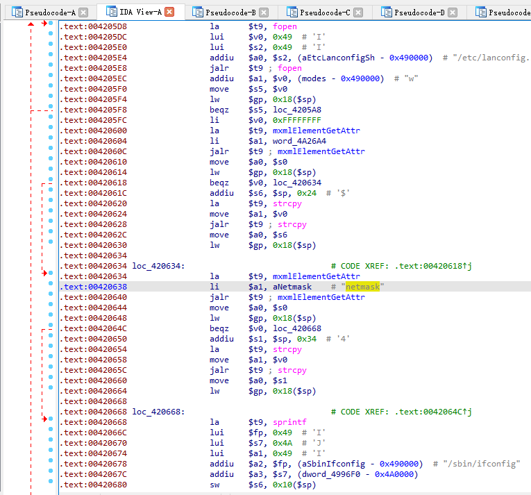  
创建一个函数反编译，虽然原作者声明只有 `netmask` 参数受影响，从这里可以看出 `ip` 参数也被拼接进了脚本，其实也是受影响的。  
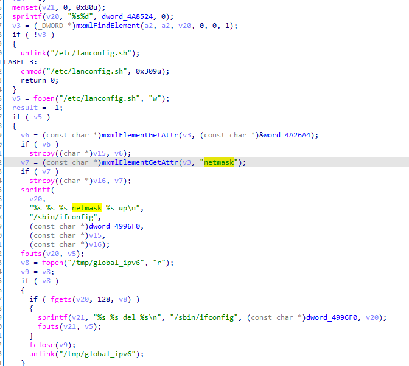  
  
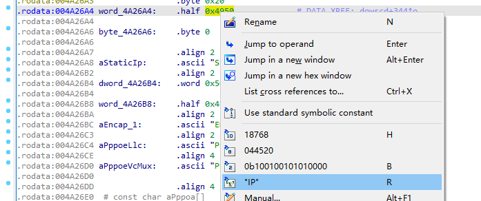  
sink 点  
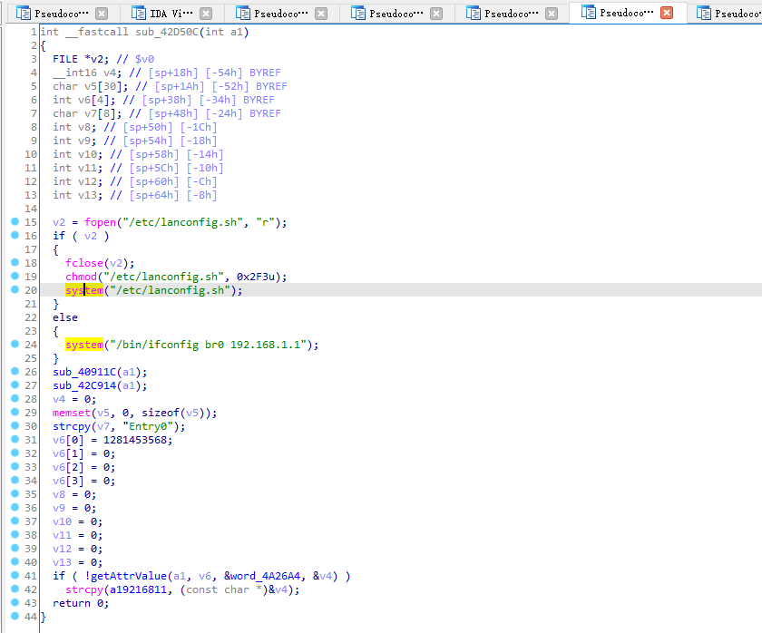  
至于此 source 点 向上跟 `mxmlFindElement()` 遇到和 CVE-2022-34527 一样的问题，没得到想要的结果。
以在跟另一个 source 点的时候举例
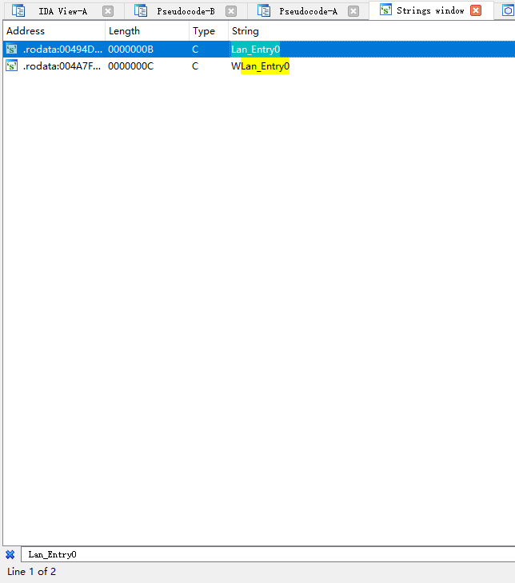  
  
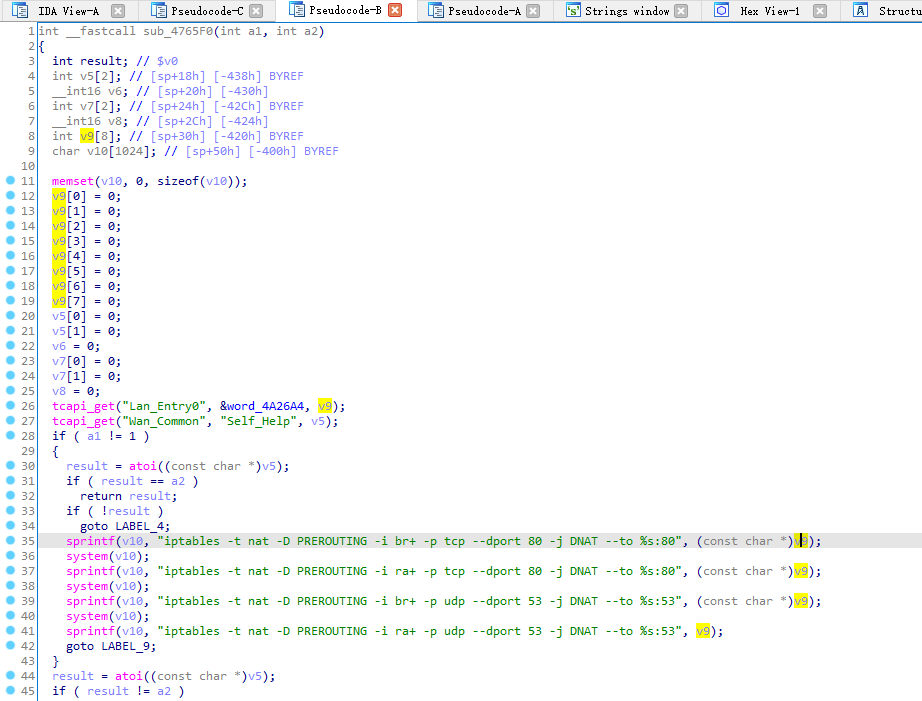  
使用 `springf()` 将 `v9` 拼接进 `v10` ，接着 `system()` 执行。  
而 `v9` 由 `tcapi_get()` 读入，跟踪如下  
`tcapi_get()` 是 extern 来的，具体实现在  lib/libtcapi.so  
  
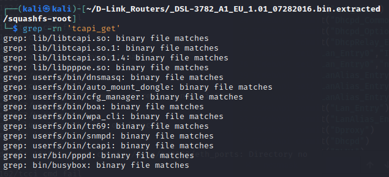  
跟进 lib/libtcapi.so ，  `tcapi_get(const char *a1, const char *a2, char *a3)` 的 `a3` 由 `v7`决定  
  
继续跟进 `send2CfgManager()` ，用 socket 可以分别向 /tmp/tcapi_sock 写入、读取数据。 由 `tcapi_get()` 的调用会读取到 `buf` 也就是 `a1` 中。
  
  
总的来说，  
用户输入 由 `boa::TCWebApi_set()` 调用 `libtcapi::tcapi_set()` 调用 `libtcapi::send2CfgManager()` 将数据写入到 /tmp/tcapi_sock 中。  
`cfg_manager::tcapi_get()` extern 的 `libtcapi::tcapi_set()` 调用 `libtcapi::send2CfgManager()` 将数据从 /tmp/tcapi_sock 读取出来。  
因此将用户输入的ip拼接进 `system()` 执行  

### 漏洞利用

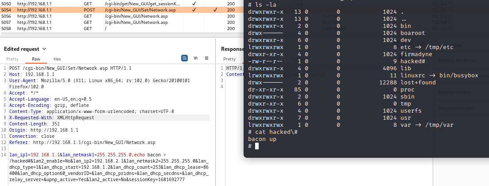  
实际上ip参数也受影响  
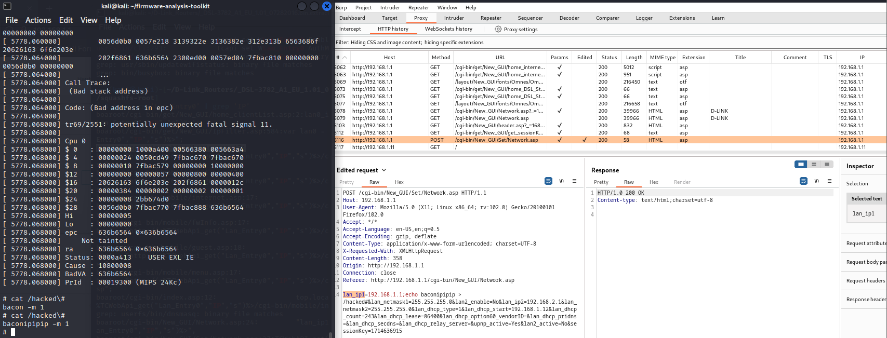  
